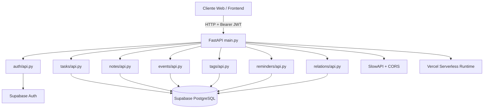
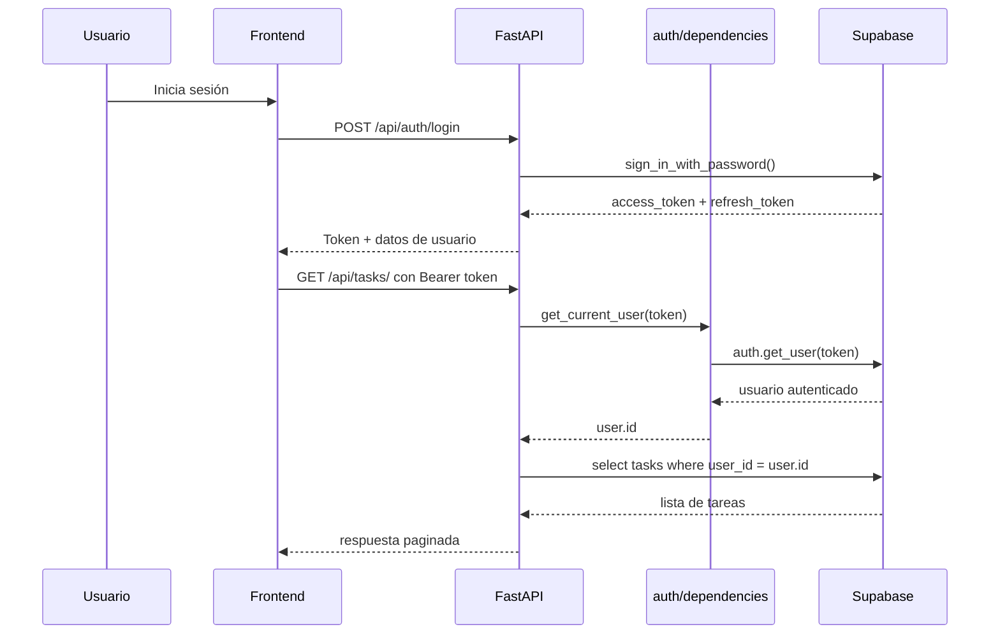

# ARCHITECTURE

## Visión General

OrganizaT es un backend monolítico modular construido con FastAPI y desplegado como función serverless en Vercel. La aplicación centraliza autenticación, CRUD de tareas, notas, eventos, recordatorios y relaciones cruzadas, usando Supabase como proveedor de base de datos PostgreSQL y autenticación JWT.

## Diagrama de componentes



## Estructura del Proyecto

```text
OrganizaT/
├── auth/
│   ├── api.py
│   ├── dependencies.py
│   └── schemas.py
├── events/
│   ├── api.py
│   ├── rules.md
│   └── schemas.py
├── notes/
│   ├── api.py
│   ├── rules.md
│   └── schemas.py
├── relations/
│   ├── api.py
│   ├── rules.md
│   └── schemas.py
├── reminders/
│   ├── api.py
│   ├── rules.md
│   └── schemas.py
├── tags/
│   ├── api.py
│   ├── rules.md
│   └── schemas.py
├── tasks/
│   ├── api.py
│   ├── rules.md
│   └── schemas.py
├── supabase/
│   └── <!-- TODO: verificar contenido -->
├── tests/
├── database.py
├── database.txt
├── main.py
├── README.md
├── requirements.txt
└── vercel.json
```

## Flujo de Datos



## Patrones Utilizados

- **Modularización por dominio**
  - Cada dominio mantiene `api.py`, `schemas.py` y en varios casos `rules.md`.
- **Dependency Injection de FastAPI**
  - `Depends(get_current_user)` resuelve autenticación por endpoint.
- **Middleware / chain de middlewares**
  - CORS y SlowAPI se registran a nivel aplicación.
- **Cliente de infraestructura compartido**
  - `database.py` centraliza la creación del cliente Supabase.
- **Serverless entrypoint único**
  - `main.py` actúa como agregador de routers y health checks.

## Dependencias Críticas

| Dependencia | Propósito | Riesgo si falla |
|---|---|---|
| Supabase Auth | Validación de JWT, login, refresh, reset | El sistema no puede autenticar usuarios |
| Supabase DB | Persistencia principal | CRUD de negocio indisponible |
| Vercel Python Runtime | Ejecución en producción | La API no despliega ni responde |
| FastAPI | Framework HTTP | No hay capa de exposición de endpoints |
| SlowAPI | Control de tráfico | Se pierde control de abuso/rate limiting |
| dotenv | Carga de secretos locales | Configuración local incompleta |

## ADR inicial

- **Fecha**: 2026-03-10
- **Contexto**: El proyecto necesita un backend ágil para productividad personal, autenticación integrada y despliegue simple en la nube.
- **Decisión**: Adoptar Python + FastAPI como framework backend, Supabase como Auth/DB y Vercel como plataforma de despliegue serverless.
- **Alternativas consideradas**:
  - Node.js + Express/NestJS
  - Django + PostgreSQL tradicional
  - Firebase/Auth + Firestore
- **Consecuencias**:
  - Se gana velocidad de desarrollo, tipado razonable y documentación automática.
  - Se depende fuertemente del ecosistema Supabase para auth y datos.
  - El modelo serverless simplifica despliegue, pero puede complicar debugging, cold starts y rate limiting en memoria.
  - El acceso directo a Supabase desde routers reduce complejidad inicial, pero limita separación estricta por capas.
