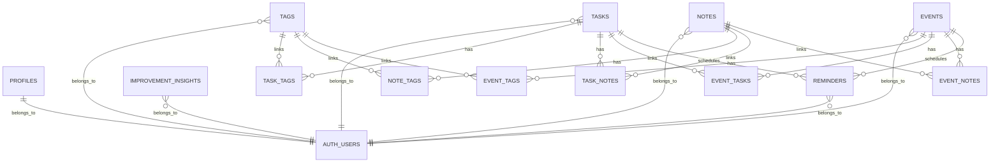

# SPECS

## Stack Tecnológico

| Tecnología | Versión | Propósito |
|---|---|---|
| Python | <!-- TODO: verificar --> | Lenguaje principal del backend |
| FastAPI | `requirements.txt` | Framework HTTP para la API |
| Uvicorn | `requirements.txt` | Servidor ASGI para desarrollo/local |
| Supabase Python Client | `requirements.txt` | Acceso a Auth y PostgreSQL |
| PostgreSQL (Supabase) | <!-- TODO: verificar --> | Persistencia principal |
| python-dotenv | `requirements.txt` | Carga de variables de entorno |
| SlowAPI | `requirements.txt` | Rate limiting |
| Vercel Python Runtime | `vercel.json` | Despliegue serverless |
| httpx | uso en código | Llamadas HTTP a Supabase Auth |

## Endpoints de la API

### Health

| Método | Path | Descripción | Auth |
|---|---|---|---|
| GET | `/` | Endpoint raíz de saludo | No |
| GET | `/health` | Estado de la API y conexión Supabase | No |
| GET | `/tables` | Lista tablas vía RPC `get_tables` | No |

### Auth / Users

| Método | Path | Descripción | Auth |
|---|---|---|---|
| POST | `/api/users/` | Registrar nuevo usuario | No |
| POST | `/api/auth/login` | Iniciar sesión y obtener JWT | No |
| POST | `/api/auth/auth/refresh` | Renovar access token con refresh token | No |
| GET | `/api/users/me` | Obtener perfil actual | Sí |
| PATCH | `/api/users/avatar` | Actualizar avatar del usuario | Sí |
| PATCH | `/api/users/password` | Cambiar contraseña autenticada | Sí |
| POST | `/api/users/password/reset` | Solicitar correo de recuperación | No |

### Tags

| Método | Path | Descripción | Auth |
|---|---|---|---|
| POST | `/api/tags/` | Crear etiqueta | Sí |
| GET | `/api/tags/` | Listar etiquetas del usuario | Sí |
| PATCH | `/api/tags/{tag_id}` | Editar etiqueta | Sí |
| DELETE | `/api/tags/{tag_id}` | Eliminar etiqueta | Sí |

### Tasks

| Método | Path | Descripción | Auth |
|---|---|---|---|
| POST | `/api/tasks/` | Crear tarea | Sí |
| GET | `/api/tasks/` | Listar tareas con filtros, vistas y cursor | Sí |
| GET | `/api/tasks/{task_id}` | Obtener detalle de tarea | Sí |
| GET | `/api/tasks/{task_id}/related` | Obtener tags, notas y eventos relacionados | Sí |
| PATCH | `/api/tasks/{task_id}` | Actualizar tarea | Sí |
| DELETE | `/api/tasks/{task_id}` | Eliminar tarea | Sí |
| POST | `/api/tasks/{task_id}/tags` | Asignar tag a tarea | Sí |
| DELETE | `/api/tasks/{task_id}/tags/{tag_id}` | Desvincular tag de tarea | Sí |

### Notes

| Método | Path | Descripción | Auth |
|---|---|---|---|
| POST | `/api/notes/` | Crear nota | Sí |
| GET | `/api/notes/` | Listar notas con filtros | Sí |
| GET | `/api/notes/{note_id}` | Obtener nota | Sí |
| PATCH | `/api/notes/{note_id}` | Actualizar nota | Sí |
| PATCH | `/api/notes/{note_id}/summary` | Actualizar resumen | Sí |
| DELETE | `/api/notes/{note_id}` | Eliminar nota | Sí |
| POST | `/api/notes/{note_id}/tags` | Asignar tag a nota | Sí |
| DELETE | `/api/notes/{note_id}/tags/{tag_id}` | Desvincular tag de nota | Sí |
| GET | `/api/notes/{note_id}/related` | Obtener relaciones de nota | Sí |

### Events

| Método | Path | Descripción | Auth |
|---|---|---|---|
| POST | `/api/events/` | Crear evento | Sí |
| GET | `/api/events/` | Listar eventos por rango y tags | Sí |
| GET | `/api/events/{event_id}` | Obtener evento | Sí |
| PATCH | `/api/events/{event_id}` | Actualizar evento | Sí |
| DELETE | `/api/events/{event_id}` | Eliminar evento | Sí |
| GET | `/api/events/{event_id}/related` | Obtener tags, tareas y notas relacionadas | Sí |
| POST | `/api/events/{event_id}/tags` | Asignar tag a evento | Sí |
| DELETE | `/api/events/{event_id}/tags/{tag_id}` | Desvincular tag de evento | Sí |

### Reminders

| Método | Path | Descripción | Auth |
|---|---|---|---|
| GET | `/api/reminders/` | Listar recordatorios con filtros | Sí |
| PATCH | `/api/reminders/{reminder_id}` | Actualizar recordatorio | Sí |
| DELETE | `/api/reminders/{reminder_id}` | Eliminar recordatorio | Sí |

### Relations

| Método | Path | Descripción | Auth |
|---|---|---|---|
| POST | `/api/relations/task-note` | Vincular tarea y nota | Sí |
| DELETE | `/api/relations/task-note` | Desvincular tarea y nota | Sí |
| POST | `/api/relations/task-event` | Vincular tarea y evento | Sí |
| DELETE | `/api/relations/task-event` | Desvincular tarea y evento | Sí |
| POST | `/api/relations/note-event` | Vincular nota y evento | Sí |
| DELETE | `/api/relations/note-event` | Desvincular nota y evento | Sí |

## Modelos de Base de Datos

### Tablas principales

| Tabla | Campos principales | Relaciones |
|---|---|---|
| `profiles` | `id`, `full_name`, `avatar_url`, `updated_at` | `id` referencia `auth.users` |
| `tags` | `id`, `user_id`, `name`, `color`, `icon`, `created_at` | pertenece a usuario; se relaciona con tasks/notes/events |
| `tasks` | `id`, `user_id`, `title`, `description`, `due_date`, `is_completed`, `calendar_event_id`, `has_reminder`, `priority`, `media_url`, `created_at`, `updated_at` | pertenece a usuario; many-to-many con tags, notes y events |
| `notes` | `id`, `user_id`, `title`, `content`, `summary`, `is_archived`, `media_url`, `created_at`, `updated_at` | pertenece a usuario; many-to-many con tags, tasks y events |
| `events` | `id`, `user_id`, `title`, `description`, `start_time`, `end_time`, `location`, `is_all_day`, `has_reminder`, `created_at`, `updated_at` | pertenece a usuario; many-to-many con tags, tasks y notes |
| `reminders` | `id`, `user_id`, `task_id`, `event_id`, `remind_at`, `status`, `created_at` | asociado a tarea o evento <!-- TODO: verificar --> |
| `improvement_insights` | `id`, `user_id`, `type`, `title`, `message`, `metrics`, `is_read`, `created_at` | pertenece a usuario |
| `task_tags` | `task_id`, `tag_id` | puente task-tag |
| `note_tags` | `note_id`, `tag_id` | puente note-tag |
| `event_tags` | `event_id`, `tag_id` | puente event-tag |
| `task_notes` | `task_id`, `note_id`, `created_at` | puente task-note |
| `event_tasks` | `event_id`, `task_id`, `created_at` | puente event-task |
| `event_notes` | `event_id`, `note_id`, `created_at` | puente event-note |

## Variables de Entorno

### Backend

| Variable | Descripción | Requerida |
|---|---|---|
| `SUPABASE_URL` | URL del proyecto Supabase | Sí |
| `SUPABASE_SERVICE_ROLE_KEY` | Service role key para operaciones backend | Sí |
| `SERVICE_ROLE` | Alias alternativo para service role | No |
| `SUPABASE_ANON_KEY` | Fallback si no hay service role | No |
| `ANON_KEY` | Alias alternativo para anon key | No |

### Frontend

| Variable | Descripción | Requerida |
|---|---|---|
| <!-- TODO: verificar --> | No existe ejemplo en este repo | <!-- TODO: verificar --> |

## Integraciones de Terceros

| Servicio | Propósito | Config relevante |
|---|---|---|
| Supabase Auth | Registro, login, refresh, recuperación | `SUPABASE_URL`, keys, JWT Bearer |
| Supabase Database | Persistencia de módulos principales | tablas SQL y joins vía cliente Supabase |
| Vercel | Deploy serverless de `main.py` | `vercel.json` |
| SlowAPI | Rate limiting del backend | `Limiter`, `RateLimitExceeded` |
| httpx | Cambio de contraseña en Auth REST | `supabase_url`, `supabase_key` |

## Convenciones del Proyecto

- Organización por dominio: `auth/`, `tasks/`, `notes/`, `events/`, `reminders/`, `relations/`, `tags/`.
- Punto de entrada único: `main.py`.
- Acceso a autenticación por dependencia `get_current_user`.
- Uso de cliente Supabase directamente desde routers; no se detecta una capa service/repository separada.
- Documentación operativa adicional en `.windsurf/rules/` y `.windsurf/plans/`.
- Estado actual de RLS: **pendiente de reactivar**; no se planea hacerlo en el corto plazo.
- <!-- TODO: verificar --> Convenciones oficiales de commits, branches y estilo adicionales con el usuario.
